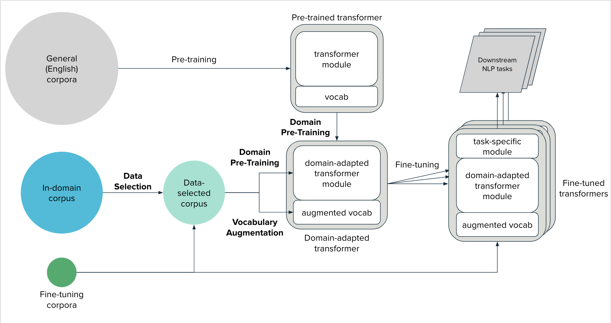

<div align="center">

<h1 style="text-align:center">Transformers Domain Adaptation</h1>
<p align="center">
    <a href="https://nlp-domain-adaptation.readthedocs.io/en/latest/content/domain_adaptation_components.html">Documentation</a> •
    <a href="https://colab.research.google.com/github/georgianpartners/NLP-Domain-Adaptation/blob/master/notebooks/GuideToTransformersDomainAdaptation.ipynb">Colab Guide</a>
</p>

[](https://www.python.org/downloads/release/python-369/)
[](https://nlp-domain-adaptation.readthedocs.io/en/latest/?badge=latest)

</div>

This toolkit improves the performance of HuggingFace transformer models on downstream NLP tasks,
by domain-adapting models to the target domain of said NLP tasks (e.g. BERT -> LawBERT).



The overall Domain Adaptation framework can be broken down into three phases:
1. Data Selection
    > Select a relevant subset of documents from the in-domain corpus that is likely to be beneficial for domain pre-training (see below)
2. Vocabulary Augmentation
    > Extending the vocabulary of the transformer model with domain specific-terminology
3. Domain Pre-Training
    > Continued pre-training of transformer model on the in-domain corpus to learn linguistic nuances of the target domain

After a model is domain-adapted, it can be fine-tuned on the downstream NLP task of choice, like any pre-trained transformer model.

### Components
This toolkit provides two classes, `DataSelector` and `VocabAugmentor`, to simplify the Data Selection and Vocabulary Augmentation steps respectively.

## Installation
This package was developed on Python 3.6+ and can be downloaded using `pip`:
```
pip install transformers-domain-adaptation
```

## Features
- Compatible with the HuggingFace ecosystem:
    - `transformers 4.x`
    - `tokenizers`
    - `datasets`

## Usage
Please refer to our Colab guide!

<a href="https://colab.research.google.com/github/georgianpartners/NLP-Domain-Adaptation/blob/master/notebooks/GuideToTransformersDomainAdaptation.ipynb" target="_parent"></a>


## Results
TODO
